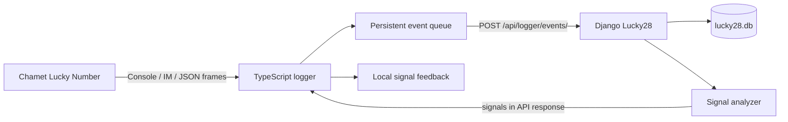

# Lucky28 + Chamet Lucky Number logger

Run the dashboard and logger together from this project:

```bash
python3 run.py
```

The command uses the root `.venv`, installs missing dependencies, compiles the
logger, applies Django migrations, waits for the authenticated API, and opens a
persistent Chrome window. It reuses an already running compatible Django server.
Press **Ctrl+C** to stop the logger and the Django process it started.

You need Python 3.10+, Node.js 22+, npm, and Google Chrome installed. On first
launch, sign in to Chamet in the new window and open **Lucky Number**. The login
is kept in this project's `.local/chamet-profile`; no browser extension or paths
to another workspace are required. Capture follows the Lucky Number console/IM
packet formats used by the original logger and accepts readable WebSocket JSON.

## Commands

| Command | Purpose |
| --- | --- |
| `python3 run.py` | Start Django and the Lucky Number logger |
| `python3 run.py --setup` | Install dependencies, build, and prepare the database |
| `python3 run.py --django-only` | Start only the Django site |
| `python3 run.py --check` | Check dependencies and authenticated API connectivity |
| `python3 run.py --port 8001` | Use another local port for both components |
| `python3 run.py --replay path/to/events.jsonl` | Import captured events without opening Chamet |

The site is at <http://127.0.0.1:8000/>. Choose **Signals → Configuration** to
create signal rules. Without active rules, results are saved and no signals are
returned. The existing standalone Streamlit dashboard can still be run with
`.venv/bin/streamlit run streamlit_lucky28/app.py`; it is not part of this launcher.

## Shared configuration and storage

Both components read the root `.env`. Keep existing values and use
[.env.example](.env.example) to add overrides as needed. Defaults work without
adding logger settings. Setup generates a shared token in `.local/logger-token`
unless `LUCKY28_LOGGER_TOKEN` is supplied. It is sent in the `X-Lucky28-Token`
header. The logger API rejects requests without a matching token.

| Location | Purpose |
| --- | --- |
| `django_lucky28/` | Django site, stored games, analysis, and signal rules |
| `chamet_logger_standalone/src/` | Active Lucky Number capture, mapping, and delivery |
| `lucky28.db` | Shared persistent database; dates remain UTC |
| `.local/chamet-profile/` | Browser profile for this project |
| `.local/chamet/pending/` | Captured events awaiting delivery |
| `.local/chamet/failed/` | Rejected events and their API error details |
| `.local/chamet/delivered.jsonl` | Successfully delivered normalized events |
| `.local/chamet/received-signals/` | Signal feedback deduplicated by signal ID |
| `.local/chamet/signals.jsonl` | Received signal journal |
| `.local/legacy-chamet-logger/` | Preserved original copy, including its nested Git history and race utilities |

The legacy copy is ignored by Git and is not loaded or executed. The active
logger has no Lucky Race scripts, coordinate betting automation, screenshot
exporters, Excel utilities, or dependencies on `master_config.csv`.

## How the APIs connect



- `GET /api/logger/health/` verifies the shared token and API contract version.
- `POST /api/logger/events/` accepts normalized pre-result or winner events and
  returns `{accepted, duplicate, game, signals}`.
- Events carry `schema_version: 1`, `game_type: "lucky28"`, `game_no`, `phase`,
  `observed_at`, and `data`. `observed_at` is the UTC capture time. A queued retry
  keeps that original time, so it cannot move yesterday's results into today.
- Pre-result events capture start, T-10, T-5, and T-0 milestones. Rates convert
  Chamet's proportions into percentages. Winners require status 3 or 4, zero
  remaining seconds, and a result from 0 through 27.
- Retryable failures remain queued. Invalid or conflicting events move to
  `failed/` with the response, allowing later games to proceed. Corrected events
  can be submitted with `--replay`; this writes to the configured database.
- Repeated winners preserve the original result and date. A conflicting winner
  returns HTTP 409. Signal analysis uses history at the event's timestamp, and
  retries return the same signal IDs without creating new signal logs.

The older `/api/games/pre/` and `/api/games/<game_no>/winner/` routes remain for
the existing UI. The active logger uses only the versioned logger contract above.
Its API calls return feedback locally and do not send WhatsApp notifications.

Signal feedback is the foundation for the later decision/acknowledgement flow.
The active logger records and displays signals; it does **not** place bets or
implement the future "bet now" decision protocol.

## Daily archive

The Django site keeps historical results in `lucky28.db`. Adding another day does
not replace earlier days. All history and analysis dates use UTC.

- Open `/days/` for the daily archive: result counts, Big/Small and Odd/Even
  totals, winners, prizes, and links to each day's history and analysis.
- Upload one or more dated CSV files at `/games/import/`. A file may contain
  multiple dates. Re-imports recognize saved results; invalid or conflicting
  rows cancel the entire upload. Historical imports do not send live alerts.
- The dashboard, `/history/`, and `/analysis/` open the latest saved day. Use
  the date selector or older/newer links to browse other days. Analysis uses
  every saved result for the selected day, in result timestamp order.
- Download a day's CSV from the archive or date selector. Downloads include
  game IDs and can be imported again. Analysis also accepts a date range.
- Use **Delete** beside a day in `/days/` to review its date and result count,
  then confirm removal. This permanently deletes that day's archived results
  and their associated signal history. You can download the CSV before deleting.

CSV format (timestamps are required):

```csv
result,timestamp,winners_count,prize_amount
19,2026-09-08 01:03:00,467,37006000
17,2026-09-07 23:59:00,450,30000000
```

Results without a winner timestamp cannot be assigned to an archived day.
Daily counts reflect the records saved so far; import additional history to
fill gaps. The legacy Game Results admin importer below feeds the Streamlit
table; use `/games/import/` for the Django dashboard and daily archive.

## Verification

```bash
.venv/bin/python django_lucky28/manage.py test games.tests
npm --prefix chamet_logger_standalone test
python3 -m unittest dataFeeds.test_extract_html_data
```

The browser integration check uses a temporary database and a local page that
emits representative Lucky Number packets. It verifies capture, API delivery,
signal feedback, race exclusion, and process shutdown without contacting Chamet:

```bash
.venv/bin/python scripts/check_logger_integration.py
```

This check needs permission to bind local ports and launch a headless Chrome
process. A real Chamet capture session still requires signing in and opening
Lucky Number; the live site's current packet format has not yet been verified.
